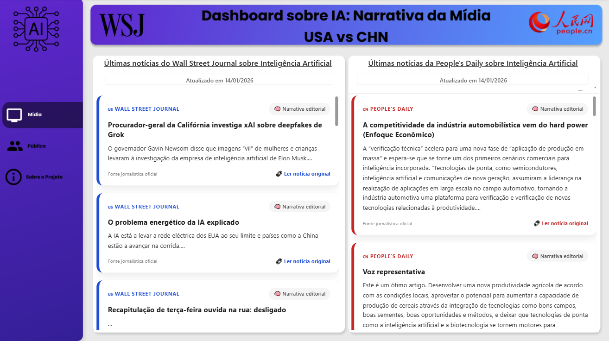

# Inteligência Artificial: Monitor Global de Narrativas e Opniões


> **Monitoramento geopolítico em tempo real sobre Inteligência Artificial.**
> Uma solução de **Engenharia de Dados End-to-End** que compara como a grande mídia e a opinião pública das duas maiores potências mundiais (EUA e China) reagem aos avanços da IA.

---

## 📸 Dashboard Preview



---

## 🏗️ Arquitetura do Projeto

O projeto utiliza um **pipeline ETL autônomo**, orquestrado localmente, com coleta, processamento, persistência e visualização desacoplados.

```mermaid
graph TD
    subgraph "1. Extração"
        A[WSJ / People's Daily] -->|Playwright| E(Orquestrador Python)
        B[X / Weibo] -->|Playwright| E
    end

    subgraph "2. Processamento"
        E -->|ETL & Tradução| F[(SQLite Database)]
        F <-->|API REST| G[FastAPI Server]
    end

    subgraph "3. Automação & Entrega"
        G --> H[Power BI Dashboard]
        I[Power Automate] -->|1. Run Script| E
        I -->|2. Refresh Data| H
        H -.->|Screenshot| I
        I -->|3. Email Report| J[📩 Stakeholders]
    end

